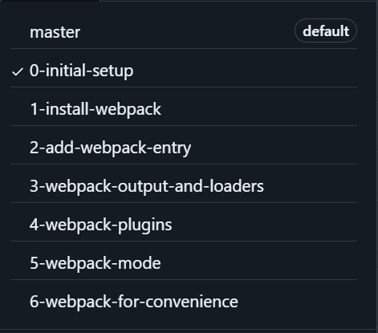

[This repo](https://github.com/udacity/fend-webpack-content) gives a step by step guide to installing webpack.

*Note there is another guide [here](https://webpack.js.org/guides/installation/), i don't know which one is better, for now*

The first branch `0-intial-setup` can be found in the `/fend-webpack-content-0-initial-setup` folder. The `README.md` file contains the next steps.

This first branch is basically a demo server.

The static file location name in the server JavaScript file needed to be changed to `app.use(express.static(path.join(__dirname,'../client')))`