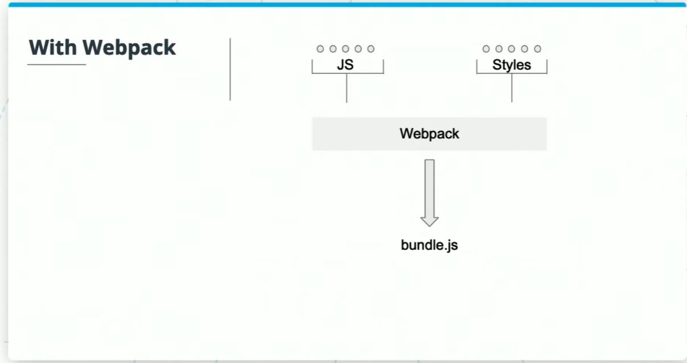

At its core, webpack is a static module bundler for modern JavaScript Applications.

webpack takes all the files on the left and bundles (combines) them into fewer files to make them easier to manage. For example mutliple .js files on the left become a single .js file on the right.

Key Terms mentioned:

**Bootstrap** is an open-source CSS library that has many basic CSS styles already designed and implemented. It can be used to create responsive web sites. Bootstrap contains CSS and JavaScript based design templates for many different web page components.

**Bootstrap Tooltip** is a text box that pops up whenever the cursor is hovering over a ceratin component or element. The text box provides hints on what to do with that certain element. It requires some third party libraries such as `Popper.js`, `popper.min.js`, `util.js`. Some examples can be seen [here](https://getbootstrap.com/docs/4.1/components/tooltips/#examples)

**Boostrap Modal** is a plugin that adds dialogs to a website for lightboxes user notifications or any other component. The variety offered ranges from sliding, to fading of a containing page and scrolling. It's similar to JavaScript alert. Some examples can be seen [here](https://getbootstrap.com/docs/4.1/components/modal/)

**Parallex** is an animation library that works with the type of animation effect where a component has a relative difference in positioning on the web page. An example is an image that can be seem to be moving when scroling a web page. There are many more libraries like it.