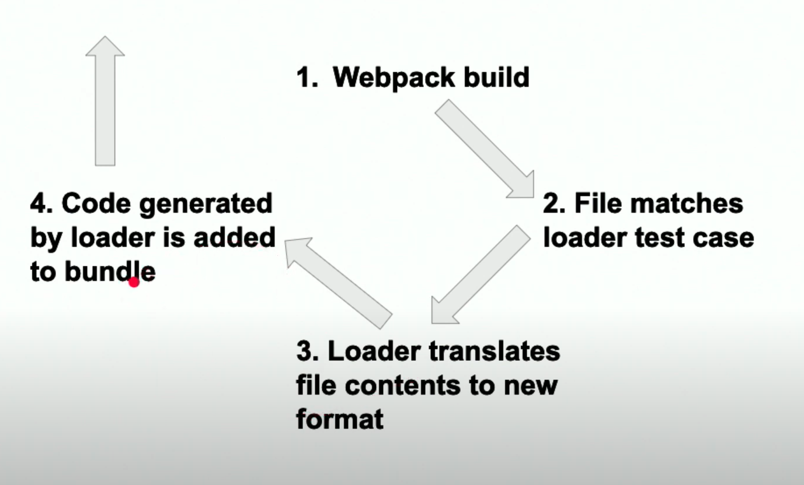
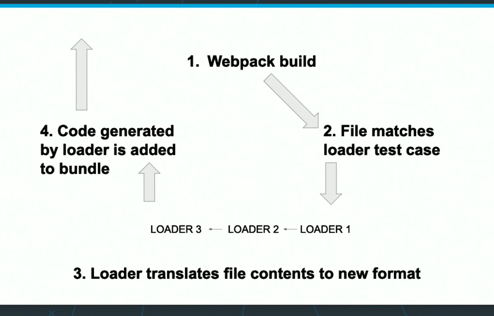

Libraries needed to set up Sass:

```bash
npm i -D style-loader node-sass css-loader 
```

```bash
npm i -D sass-loader
```

In the dev and prod webpack config file loaders section:

```js
{
        test: /\.scss$/,
        use: [ 'style-loader', 'css-loader', 'sass-loader' ]
}
```

Make sure the test regex is not put in qutotations `''`.

The `use` property allows for specifying multiple loaders in the same rule that can be chained togther, also known as **chaining loaders**. 

Meaning, the output of one loader can be placed directly as the input to the next loader (instead of outputting to the `dist` folder the results).

Chaining loaders start from the right to left, meaning end of the list to the start.

With a singe loader, the flow would look like this:



When there are multiple loaders, the build flow would look like this:



After adding the chained loaders, the project can be built as normal. But, the css won't be loaded yet.

The new `.scss` files need to be imported into the `index.js` file:

```js
import './styles/resets.scss'
import './styles/base.scss'
import './styles/footer.scss'
import './styles/form.scss'
import './styles/header.scss'
```

Currently, the CSS styling appears later than it should. This is because it is being loaded in the JavaScript. For a dev environment, this is not a problem but for a production environment this will be fixed.