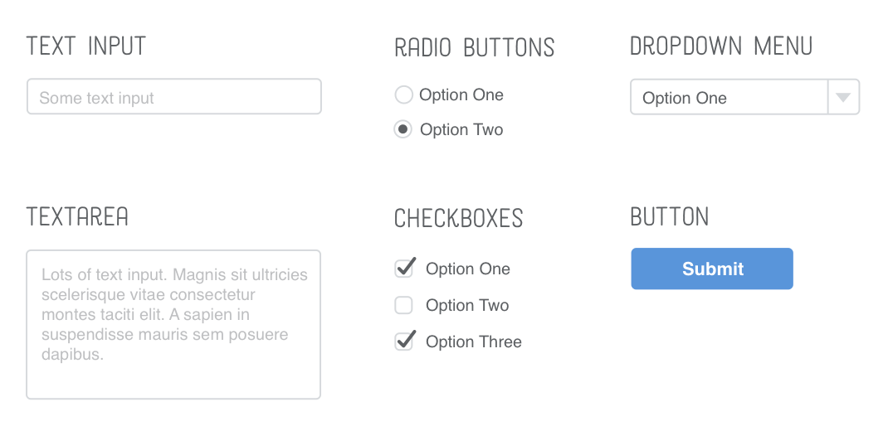

An HTML form `<form>` is used to collect information from a page and send it somewhere else. Many inputs on the internet, like text fields, are part of a form.

There are many types of HTML form inputs:

* text input
* text areas
* radio buttons
* Checkboxes
* dropdown menus
* buttons
* and more



Examples of form inputs.

# Input Types, Select and Textarea

An `<input>` tag can be used to create an input. The type of input can be specified with the `type` attribute.

 The `<form>` element can be used as a container for everything contained with a form, from the input elements to other descriptive elements. The legend elemnt `<legend>` is used to give the form a small title. The fieldset element `<fieldset>` is used to create a boundary around the inputs contained within that element.

An example:

```html
<form>
    <legend>Input Types</legend>
    <fieldset>
        Text input: <input type="text"><br>
        Checkbox input: <input type="checkbox"><br>
        Radio button input: <input type="radio">
    </fieldset>
</form>
```

<form>
    <legend>Input Types</legend>
    <fieldset>
        Text input: <input type="text"><br>
        Checkbox input: <input type="checkbox"><br>
        Radio button input: <input type="radio">
    </fieldset>
</form>

\
The attribute `check` can be used to have a button (radio, checkbox etc.) by default be selected.

The `select` element can be used to create drop down menu.

An example:

```html
<form>
    <legend>The "Select" Input</legend>
    <fieldset>
        <label for="color-select">Choose a color:</label>
        <select id="color-select">
            <option value="">Please choose an option</option>
            <option value="blue">Blue</option>
            <option value="red">Red</option>
            <option value="green">Green</option>
            <option value="yellow">Yellow</option>
            <option value="orange">Orange</option>
            <option value="pink">Pink</option>
        </select>
    </fieldset>
</form>
```

<form>
    <legend>The "Select" Input</legend>
    <fieldset>
        <label for="color-select">Choose a color:</label>
        <select id="color-select">
            <option value="">Please choose an option</option>
            <option value="blue">Blue</option>
            <option value="red">Red</option>
            <option value="green">Green</option>
            <option value="yellow">Yellow</option>
            <option value="orange">Orange</option>
            <option value="pink">Pink</option>
        </select>
    </fieldset>
</form>

\
The label element `<label>` can be used to give viewable text for an input.

The text area element `<textarea>` can be used to create a larger, more free-form text field for a user.

An example:

<form>
    <legend>Text Area Form</legend>
    <fieldset>
        <label for="learn">What do you hope to learn about today?</label>
        <textarea id="learn" name="learn" rows="5" cols="30">I hope to learn about....</textarea>
    </fieldset>
</form>