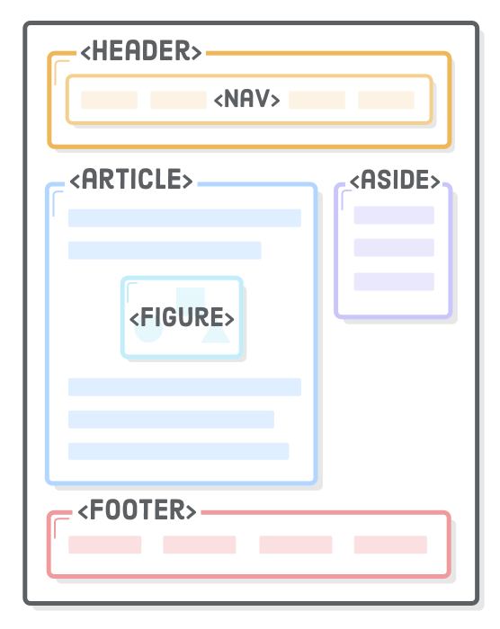

**DOM** stands for Document Object Model. It refers to the model that a webpage follows. The DOM can be visualized as a tree, where each node contains an element and each branch ends in a node. It's represented as a tree because a webpage starts as with a single element node that branches out into many nodes. A node that falls below another node is considered its child.
\
\
In order for an HTML file to be set up properly, it must use certain tags. All HTML files need to start with `<!DOCTYPE html>` to tell the browser the current file is a HTML file and what HTML version to use. Currently, the standard is HTML5, so by default most browsers will assume HTML5 when seeing the doctype tag. But in the future there may be a different HTML standard version so it's important to specify the doctype tag at the begninning of HTML documents.


# The Head `<head>`

The head tag `<head>` goes into the HTML tag `<html>` before the body tag `<body>`. It's used to contain metada about the web page. Metadata is information about the page that is not displayed directly onto it i.e. information about the page itself. An example is the title of the page which can be used to define the webpage's title in the tab it's on, using the `<title>` tag.

An example:

```
<!DOCTYPE html>
<html>
    <head>
        <title>My COding Journal</title>
    </head>
</html>>
```

# The Body `<body>`

The body contains the content of the website that is displayed to the user which includes things like text, images, buttons and others.

# Hierarchy

HTML organizes elements in a family tree relationship. An element nested within another element is considered that elements child while the outer element is considered the parent. This relationship can go even further where there could be grandparents, grandchildren great grandchildren and so on. An element can have many ancestors and descendants. Elements nested on the same level are known as sibling elements.

The family tree relationship is also called a hierarchy. It's important to know as when it comes to styling elements are able to inherit the style of their parent elements.

An example:

```
<body>
    <p>This paragraph is a child of the body</p>
</body>
```

The `<p>` element is a child of the `<body>` element.

```
<body>
    <div>
        <h1>Sibling to p, grandchild to body</h1>
        <p>Sibling to h1, grandchild to body</p>
    </div>
</body>
```

* `<body>` is the parent of `<div>` and grandparent to `<h1>` and `<p>`. 

* `<div>` is the child of `<body>` and parent to `<h1>` and `<p>`. 

* `<h1>` and `<p>` are siblings, children of `<div>` and grandchildren of `<body>`.

# Semantic Elements

Semantic elements are used to organize the main parts of a page. They usually contain other elements.

Some examples of semantic elements:

* `<header>` represents the first element of the page. It contains elements that are on the top of the page such as a logo or tagline.
* `<nav>` represents a list of links that go to different pages on the website (but can link to other websites)
* `<h1>` a header tag, represents the title of page
* `<article>` contains the main content of the page, like the blog in a blog post
* `<footer>` represents the last elements of the page, contains the elements that should appear at the bottom of the page.



An example of how semantic elements can be used to structure a webpage.