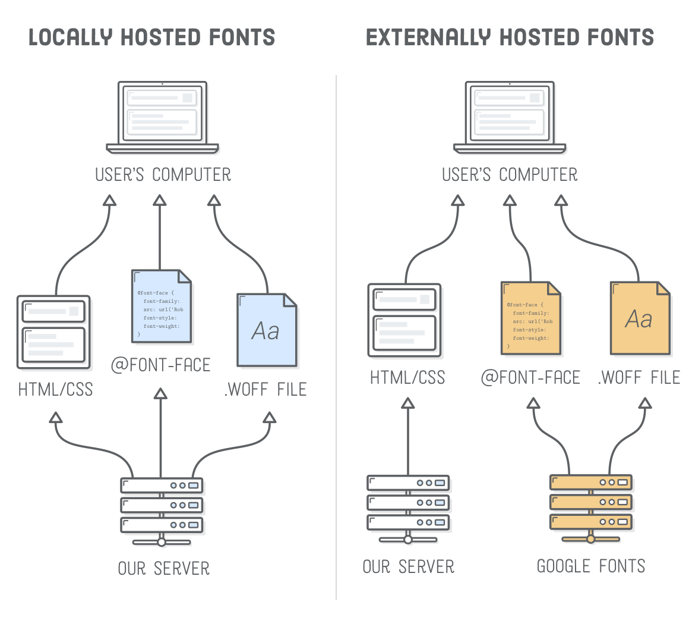

# Font Family

`font-family` is a CSS property that defines the font used for text. Multiple font families can be defined, the ones that are not first act as alternatives to the first one in case the intial font is not available. Fonts that are available by default on devices are called websafe fonts. More information about them can be found [here]("https://web.mit.edu/jmorzins/www/fonts.html")

# Font Weight and Style

Font weights are expressed as a value between 100 and 900 in CSS. 900 usually means Black, 700 is bold, 400 is regular etc. Most font families don't show a value for every single weight. A face for a font refers to a styling and weight combination In high-quality fonts, each letter of every face is hand-crafted to make sure the text has uniform flow. Which means a bold text is just a thicker version nor is a condensed style just a squashed version of the roman faces.

# Emphasis and Importance

Emphasis usually refers to italics. It's best to use the `<em>` tag for italic.

An example:

```html
<p>
    We <em>have</em> to buy the latest version of the pet hari remover vacuum, the floor is covered with fur.
</p>
```

<p>
    We <em>have</em> to buy the latest version of the pet hari remover vacuum, the floor is covered with fur.
</p>


\
For important words, it's best to use the strong tag `<strong>`. By default, it's used to make words bold, but that is only the default browser behavior and can be overridden. The purpose of `<strong>` is not just to make text bold, but to make it important.

An example:

```html
<p>
    My dog is the most <strong>important</strong> creature in my life right now
</p>
```
<p>
    My dog is the most <strong>important</strong> creature in my life right now
</p>

# External Fonts

There are lots of ways to host a font from an external source. A common used method is by using google fonts (can be found [here]("https://fonts.google.com/")). Once a font has been selected, a line of code will be provded to be added in the `head` section of the html, like this:

```html
<head>
    <link href="https://fonts.googleapis.com/css?family=Montserrat&display=swap" rel="stylesheet">
</head>
```

The CSS property in an element can be done like this:

```css
.box{
    font-family: 'Montserrat', sans-serif;
}
```

The difference between externally and locally hosted fonts are like this:

