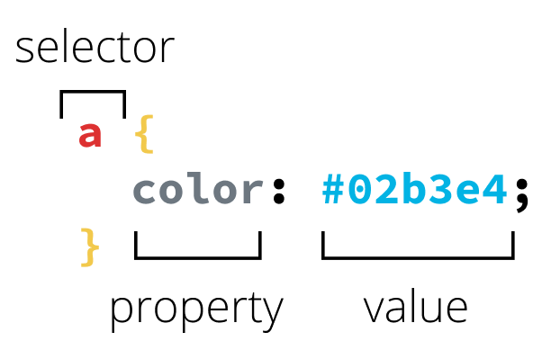

An element can be selected by CSS to be styled using the element's selector. The most general selector is the element's tag name. Using CSS to style a `<p>` can be done by just using `p` as the selector.

For example:

```
p {
    color: red;
}
```

The syntax for a CSS selector, property and value are as follows:




# Classes

If the styling should not be applied to every element with the same tag, classes can be used to apply a style to a group of elements that have the same class name. An element can be given a class by using the `class` attribute in the element with the class name. 

For example:

The HTML
```
<p class="brand">Soel Shoe Company</p>
```

The CSS
```
.brand{

}
```

`.` is used to select a class in CSS, where it is placed before the name of the class.

# IDs

If only one element is to be styled in a specific manner, the `id` attribute is used. An element can have both an id and a class, although classes are not required.

An example:

The HTML
```
<p id="solo" class="brand">Solo Show Company</p>
```

The CSS
```
#solo{
    color:purple;
}
```

The same way classes use `.` to specify a class in the CSS style sheet, ids use `#` to specify an id in the style sheet.

# Pseudo classes

A CSS psuedo class refers to a keyword that is added to a selector which represents a special state of the selected element. For example, the `hover` pseudo class is used to specify an action when the mouse cursor is hovering over an element.

The syntax is as follows:

```
selector:pseudo-class{
    propery:value;
}
```

# Attributes

An element can be selected based on an attribute it may contain. `[]` are used as the general syntax of selecting based on an atttribute.

An attribute can be selected based on the attribute itself or its value. 

Some examples are:

* `[attr]` the selector will select any element that contains an attribute with the name of `attr`, regardless of the value.
* `[attr=val]` the selector will select any element that contains an attribute with the name of `attr` and the value of `val`.
* `[attr~=val]` the selector will select any element that contains an attribute with the name of `attr` and if its value contains `val` seperated by white spaces (sort of like a word in a sentence). *After some testing, I think css does this by default*

An example:

```
img[alt]{

}
```

# Multiple Selectors

If the purpose is to give multiple different kinds of elements the same styling, multiple selectors can be used to style them the same way with a single rule.

An example, to style all headings to have the same font:

```
h1, h2, h3, h4, h5, h6{
    font-family: "Helvetica", "Arial", san-serif;
} 
```