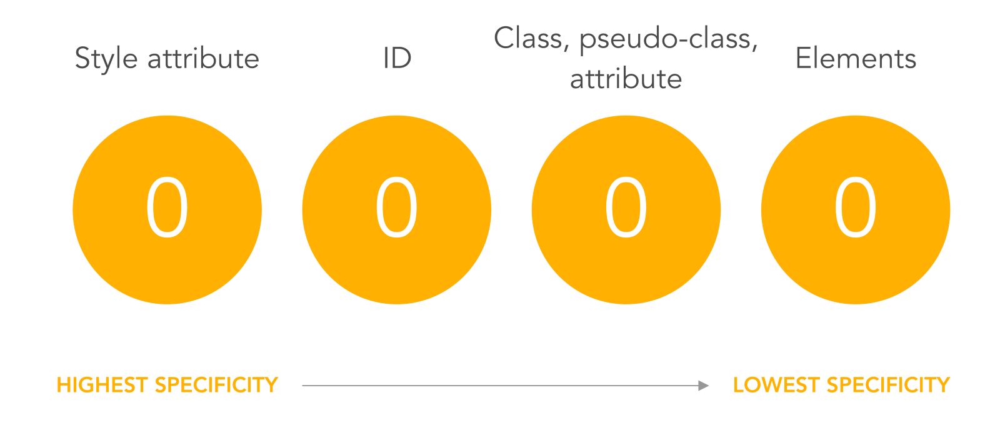

Because HTML elements can be selected by more than one selector at once, there is a logical order of which selector's styling takes precedence. It goes like this:

* Type selectors i.e. selecting by element type (paragraph p, etc) and psuedo-elements (like ::before)
* Class selectors (like .class), attribute selectrs (like [type="radio"]) and psuedo classes (like:hover)
* ID selectors (like #id)
* Style attributes (`style=""`)

The `!important` keyword can be added to an individual CSS property rule to override the previously mentioned precedence. But, it should be avoided. (Except for the style attribute I believe)

