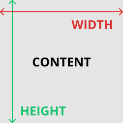

The box model is one of the basic buidling blocks of CSS. When a browser renders a webpage, it draws each element as a rectangular box following the ruels of the CSS box model.

The box model stats each element on a page is a rectangular box that may have:

* width
* height
* padding
* borders
* margins

# Content

The content of the box has height and width.



# Padding

The padding is the distance between the content box and the border. It is added on top of the width and height. It's considered to be inside the element.


# Border

The border is a line drawn around the padding and content boxes. It is defined as follows:

`border: strokeWidth style color`

For example:

`
border: 1px: solid: black;
`

Borders and paddings can be limited to only one part of the element using the keywords `-top`, `-bottom`, `-left`, `-right`.

The border will be rendered right next to the padding with no space inbetween them.

Borders are very useful for debugging as if an element is not being rendered properly, a border can be added to that element to see how it's being renderd.


# Margin

Margins represent the space surrounding the border. It's the space that's between the current element's box and other elements' boxes.


Every box on a webpage can be seen by adding this CSS rule:

```css
* {
  border: 1px solid red !important;
}
```