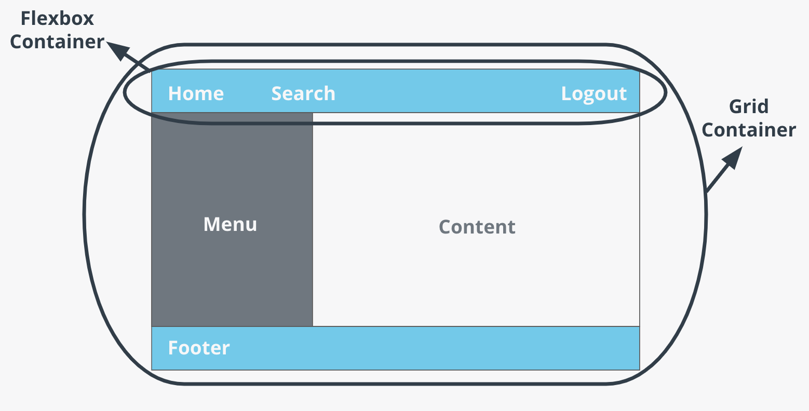

CSS Grid is a type of display, it can be chosen by setting the `display` property to `grid`. Like flex, grid allows for the use of `justify-content`.

CSS Grid does not replace the flexbox.

Each does things the other cannot. They can be used in harmony if used correctly.

Grid excels at creating layout for a webpage, Flexbox is great for content flow for each element within a page layout.

In other words, Grid is for how content is placed while flex works for regions within the layout (grid)

Summary points:

* Grid is two dimensional while flex is only one dimensions.
* Grid is layout first while flexbox is content first
* Flex is used for the components of a webpage while Grid is used for the webpage layout itself