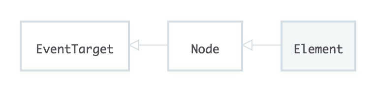

The element interface is a blueprint for creating elements. The element interface is a descendent of the Node interface.



Element points to Node, its parent. This means that Element inherits all of Node's properties and functions, which means any object created using Element will also contain all of Node's properties and functions.

When viewing an element with the devtools on chrome, an element can be highlighted in the HTML, that element can then be referred to in the JavaScript console as `$0`. Though, by using the `document.getElementBy....` methods the element node can be accessed as well. Any element that returns Node type = 1 falls under teh Element interface.

`.className` can be used to get the name of the class an element has.

`.hasAttribute()` will return true or false depending on whether or not that attribute is present in the element.

More functions and properties can be found [here](https://developer.mozilla.org/en-US/docs/Web/API/Element).


By first selecting an element using `document.getElementBy...` then doing another selection based on that first selected element, the element searching will go through the the selected element and their children.

For Example:

```js
const sidebarElement = document.getElementById('sidebar');

const subHeadingList = sidebarElement.getElementsByClassName('sub-heading');
```

The first line selected the element with the `sidebar` Id. The second line would search `sidebarElement` for elements that contain the class `sub-heading`.