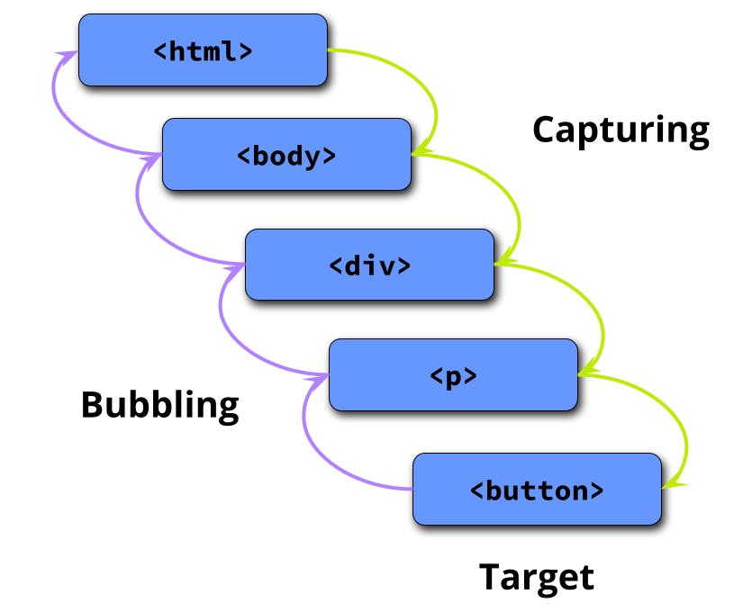

When an event is fired, the **capturing** phase begins, which goes through the DOM tree starting from the root (the `<html>` element) all the way through to the event responsible for the event being fired.

Next, the **at target** phase is done.

Finally, the **bubbling** phase starts where it goes back up through the DOM tree starting at the element that triggered the event all the way to the top of the tree to the `<html>` element.

