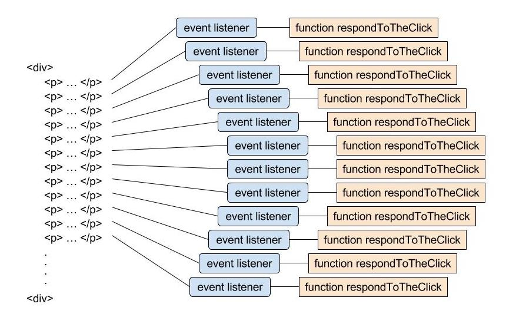
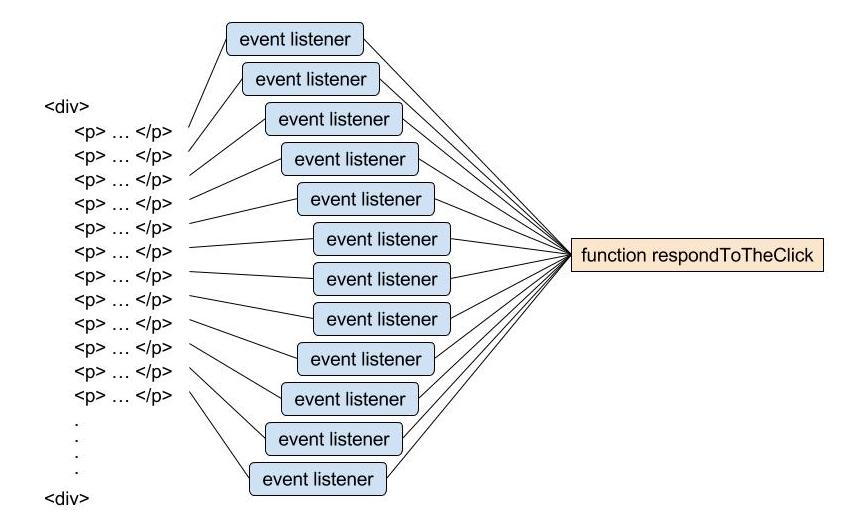
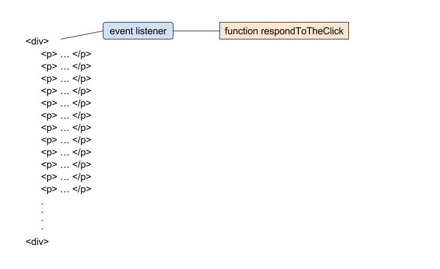

# Creating Lots of Event Listeners with loops

The following code creates many event listeners:

```js
const myCustomDiv = document.createElement('div');

for (let i = 1; i <= 200; i++) {
    const newElement = document.createElement('p');
    newElement.textContent = 'This is paragraph number ' + i;

    newElement.addEventListener('click', function respondToTheClick(evt) {
        console.log('A paragraph was clicked.');
    });

    myCustomDiv.appendChild(newElement);
}

document.body.appendChild(myCustomDiv);
```

The code creates a div element that adds 200 paragraph elements using a for loop. Each paragraph element will also have an event listener added to it in the loop. The new div is appended to the body.


Check out the example of this code in `index.html`.

The large number of event listeners can be visualized as follows:



# Refactoring The Number of Event Listeners

Instead of creating a new function for every element, the functions can be extracted to an external function (since they all use the exact same function) and each event listener can be pointed to that function. That would mean there is 1 function instead of 200 that the browser will need to keep track of.

The code would be modified to be as follows:

```js
const myCustomDiv = document.createElement('div');

function respondToClick(){
    console.log('A paragraph was clicked.');
}

for(let i=1; i <= 200; i++){
    const newElement = document.createElement('p');
    newElement.textContent = 'This is paragraph number ' + i;

    newElement.addEventListener('click', respondToClick);

    myCustomDiv.appendChild(newElement);
}

document.body.appendChild(myCustomDiv);
```

The changes can be visualized as follows:



Though this is much better than before, there are still way to many different event listeners that are all pointing to the same listener function.

They could all be moved ot the div element instead.

That would look like this:




The new code would be like this:

```js
const myCustomDiv = document.createElement('div');

function respondToClick(){
    console.log('A paragraph was clicked.');
}

for (let i=0; i<200;i++){
    const newElement = document.createElement('p');
    newElement.textContent = 'This is paragraph number ' + i;

    myCustomDiv.appendChild(newElement);
}

myCustomDiv.addEventListener('click', respondToClick);

document.body.appendChild('myCustomDiv');
```
This is much more optimized because now there is only a single event listener and a single listener function in contrast to 200 event listeners and 200 listener functions.


There is an issue with this though. The event listener for each element cannot be accessed on its own, only through the main event listener in the div element. If a specific action is supposed to be taken depending on the element interacted with, it won't be possible.

However, there is a way to have both the efficient code and still have access to each individual event listener through **event delegation**.