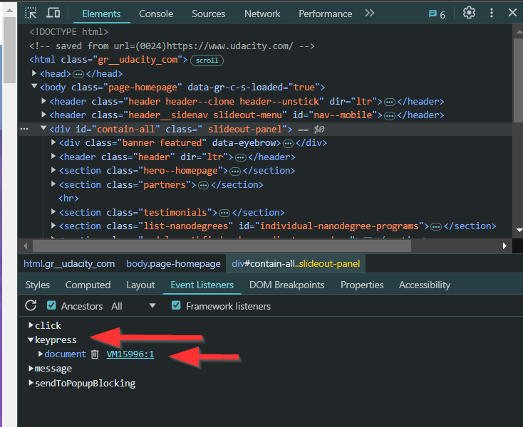

# Examining Event Listeners in Dev Tools

The dev tools in chrome can be used to find the event listeners attached to an element.

In the elements section, on the bottom, there is an `Event Listeners` tab that shows all event listeners for that element. Setting the `Ancestors` check box shows the event listeners that are inherited.


An example usage:

If the following code was added to the JavaScript:

```js
document.addEventListener('keypress', function() {
    console.log("removing first child");
    document.querySelector('#contain-all').firstElementChild.remove();
});
```

It would add an event listener to the entire document that removes the first element every time a key is pressed.

It appears like this when clicking on any element and checking the `Ancestors` checkbox:



The  `Event Listeners` tab is great for insepcting all event listeners attached to an element or its ancestors. It can also be used to remove it for a current session. It also allows for inspecting the funciion that runs when the even listener is triggered.