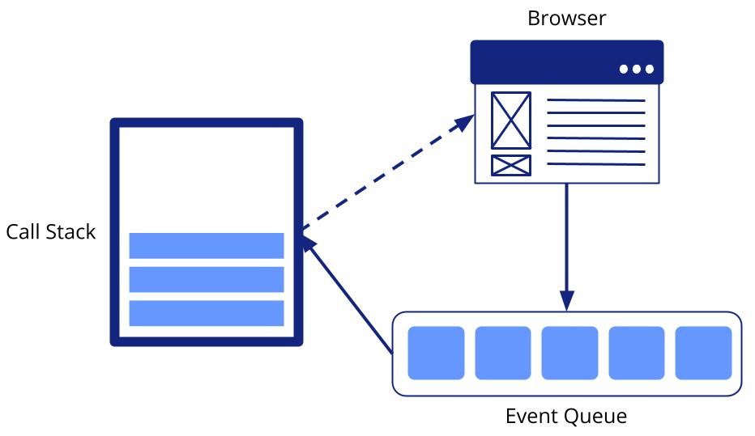

# Where does the code or event listener's function go?

An example:

```js
console.log('howdy');
document.addEventListener('click', function numbers() {
    console.log('123');
});
console.log('ice cream is tasty');
```

When there is code such as this, the code inside the listener function is made to wait until the necessary event calls on it to respond then it is executed.

The **JavaScript Event Loop** is responsible for determining where the function is when it is waiting and how the function gets run when it is needed to.

# JavaScript Event Loop

Basically, the JavaScript **Concurrency Model** uses two rules:

* if some JavaScript is running, let it run until it is finished
* if no JavaScript is running, run any pending event handlers

Since most JavaScript is run in response to an event, this is known as the **event loop**, pick up the next event, run its handler and repeat.


There are three parts revolving around the event loop:

* The Call Stack
* Web APIs/the browser
* An Event Queue




Not every code that is used in JavaScript is written in 100% JavaScript. Some of the code is interacting with web APIs (also known as browser APIs). The `addEventListener()` and `setTimeout()` functions are both examples of web APIs.


During normal code execution, only the call stack is used to handle funcion calls. But when the function call involves a web API or any async code, it resolves the function call in the call stack then passes the event listner to the browser for handling. The rest of the JavaScript code is then executed. With the browser containing the event listener, it waits for the actions to cause the event to be fired. When the event is fired, it is passed to the **event queue**. The event queue then passes the event to the call stack to execute the listener function. once the event listener function is executed, it is popped out of the stack.

This entire operation is called the event loop.

The queue only passes the event listener function it contains after every function in the call stack is popped (also known as idle time), which is why it is placed in the queue in the first place (this is because of JavaScript\s run-to-completion nature; code that is currently happening cannot be interrupted).

Asynchronous code such as loading an image is run outside of this loop and sends an event once its finished.

Events are processed only when the browser isn't busy.