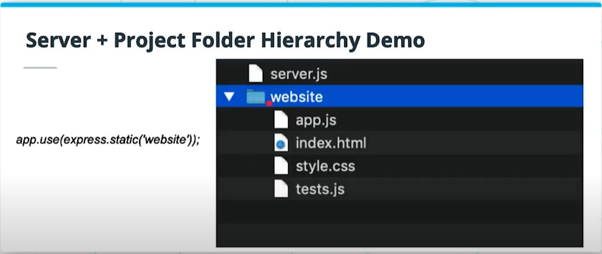

A webpage project that doesn't include any server files in it usually contains all their files within one folder. There is usually a `index.html` file that points to any other file (like CSS and JavaScript) that it may need.

But when there is a (Express) server involved, usually there are server files and there are client files. They need to be seperated but at the same time within the same hierarchy.

The `app.use(express.static('static'))` lines is usually used to point to a folder that contains all the files that will be sent to the client to run the webpage. It takes the name (or path) of the folder in string format as an argument.

An example:

*Note: sometimes it's better to use `app.use(express.static(path.join(__dirname, '/static')));`*