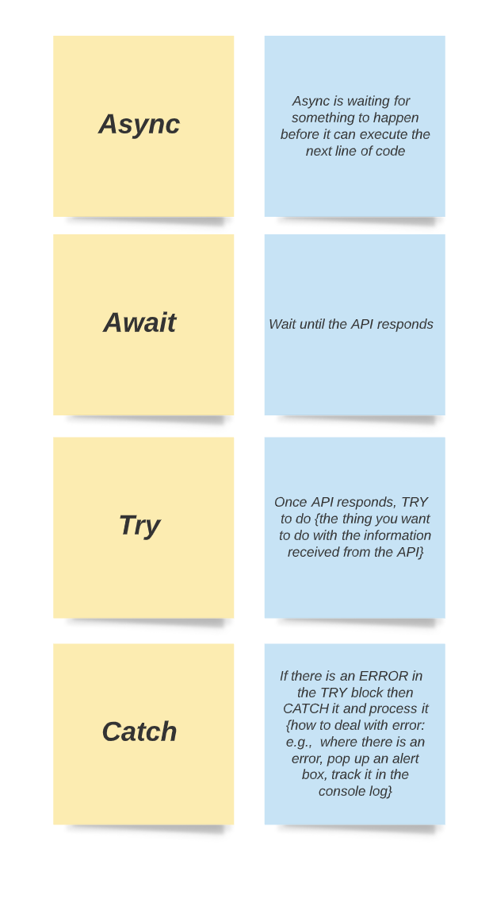

While there has always been some ways to write async code like with `setTimeout()` and AJAX, a recent tool called **Promises** has been introduced natively to JavaScript. They are the accepted best practice for writing async functions in JavaScript.

Promises are basically a special function that either satisfy or fail to execute a task. It then executes corresponding actions which are usually another task with the returned data in the case where the task is executed and throwing an error when the task failed to execute.

# Basic Anatomy of a Promise:

The basic syntax is like this:

```js

var promise = new Promise(funciton(resolve, reject){
    // do something

    if (/* condition */){
        resolve("Sucess!");//Indicate sucess
    }
    else{
        reject(Error("It Failed")); //Indicate failure
    }
});


promise.then(
    function(value) {/* Some code if successful */}, // value of `resolve()` can be accessed from the `value` variable (in this case the "Sucess!" string)
    function(error) {/* code if failure */ } //value of the `reject()` can be accesses from the `error` variable (in this case the `Error("It Failed")` value)
);

```

Promises are recommended for writing async code because they offer flexibiltiy, intuitive syntax and easy error handling.

Up until ES2017 (ES8), they required boilerplate (repetitive) code, called generators, to be able to run asynchornously. Now, the `async` keyword can be used to apply to a JavaScript function, making it a promise, to easily execute async JavaScript code.

An example:


```js
const postData = async ( url = '', data = {})=>{
    
      const response = await fetch(url, {
      method: 'POST', // *GET, POST, PUT, DELETE, etc.
      credentials: 'same-origin', 
      headers: {
          'Content-Type': 'application/json',
      },
      body: JSON.stringify(data), // body data type must match "Content-Type" header        
    });
  
      try {
        const newData = await response.json();
               return newData
      }catch(error) {
      console.log("error", error);
      // appropriately handle the error
      }
  }

  postData('/addMovie', {movie:' the matrix', score: 5})
```

The use of `async` here makes the calling of the `fetch()` function asynchronous.

Once `async` has been used, the `await`, `try` and `catch` keywords can be accessed.

The `await` keyword is used to pause execution of code until a certain process is finished.

The `try` and `catch` keywords are used to validate code as with the `resolve()` and `reject()` function do in async promises.

In summary:

